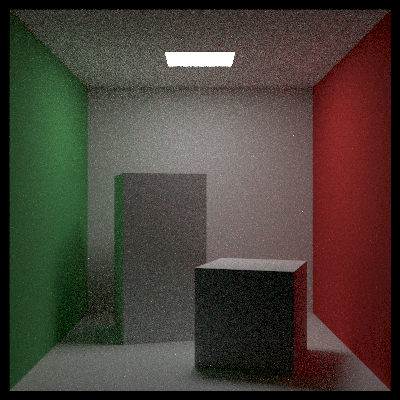
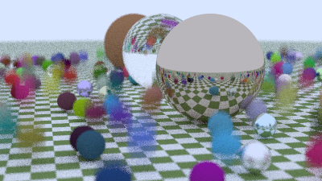

# Nearlighter

Nearlighter 是一个基于物理的CPU端路径追踪渲染器，支持简单光线追踪渲染功能，基础框架参考[Ray Tracing in Oneweekend系列](https://github.com/RayTracing/raytracing.github.io)。持续开发完善中，作为个人实践试验项目。

### 功能特性

- 基本光线传播模拟计算，BVH加速结构
- 图像输出：多采样抗锯齿(MSAA)，相机景深+散焦+动态模糊，
- 基础图元：球体(Sphere)、四边形(Quad)、实例化对象组合，变换矩阵支持的几何体
- 材质系统：漫反射表面(Lambertian)、镜面反射表面(Metal)、折射电介质(Dielectric)、自发光表面(DiffuseLight)、体积各向同性散射(Isotropic)
- 贴图系统：简单空间纹理(SolidTexture)、图片纹理(ImageTexture)、噪声纹理(NoiseTexture)与生成(Perlin Noise)
- 体渲染：恒定介质(ConstantMedium)

### 待实现

紧急： common.h 头文件引用混乱

---

待实现特性

- [ ] 接入第三方窗口管理和UI
- [ ] 支持导入Mesh模型
- [ ] 曲面细分
- [ ] 更优加速结构: SAH
- [ ] 多线程加速渲染
- [ ] GPU并行加速渲染(CUDA)
- [ ] 实时光线追踪支持，降噪算法

### 使用方式

构建： CMake

```
mkdir build && cd build
cmake ..
make
./Nearlighter -s <scenary_num>
```

支持跨平台

### 渲染示例

Cornell Box

- WSL2 - Ubuntu 24.04 - 9955HX - Single Core : SPP = 64, depth = 25, 400x400, Rendering Time: 1m43s



MultiBalls



### 项目结构

```
.
├── src/         # 核心源码
│   ├── camera/      # 相机模型
│   ├── material/    # 材质系统实现
│   ├── shape/       # 几何形状基类与实现
|   |     └── transform/ # 仿射变换支持
│   ├── bvh/         # BVH加速结构
│   ├── texture/     # 纹理生成模块
│   ├── medium/      # 体积渲染实现
|   └── utils/       # 工具杂项：图片加载，柏林噪声生成，计时器
├── include/     # 第三方库
│   ├── glm/
│   └── stb/
└── main.cpp     # 主程序入口
```

### 参考资料

- [Ray Tracing in Oneweekend系列](https://github.com/RayTracing/raytracing.github.io)
- [GAMES101课程](https://games-cn.org/intro-graphics/)
- [STB图像库文档](https://github.com/nothings/stb)
- [GLM数学库](https://glm.g-truc.net/)
