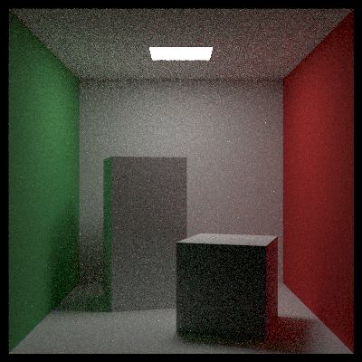
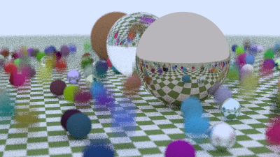

# Nearlighter

Nearlighter 是一个基于物理的CPU端路径追踪渲染器，支持简单光线追踪渲染功能，基础框架参考[Ray Tracing in Oneweekend系列](https://github.com/RayTracing/raytracing.github.io)。持续开发完善中，作为个人实践试验项目。

## 功能特性

### 当前实现

- 可切换积分器：保留历史 `legacy` 路径，并提供显式 BSDF、NEE 与 MIS 的
  迭代 `path` 路径
- 基本光线传播模拟计算，BVH加速结构
- 图像输出：多采样抗锯齿(MSAA)，相机景深+散焦+动态模糊，
- 基础图元：球体(Sphere)、四边形(Quad)、实例化对象组合，变换矩阵支持的几何体
- 材质系统：漫反射表面(Lambertian)、镜面反射表面(Metal)、折射电介质(Dielectric)、自发光表面(Emissive)、体积各向同性散射(Isotropic)
- 贴图系统：简单空间纹理(SolidTexture)、图片纹理(ImageTexture)、噪声纹理(NoiseTexture)与生成(Perlin Noise)
- 体渲染：恒定介质(ConstantMedium)
- 实验诊断：typed Film、emission/direct/indirect AOV、逐像素样本数与方差、
  分阶段准备时间和 ray/path 计数

### 待实现

当前阶段：在基础工程结构重构完成后，继续进行正确性修复、测试建设和性能优化。

---

待实现特性

- [ ] 接入第三方窗口管理和UI
- [ ] 曲面细分
- [ ] 更优加速结构: SAH
- [ ] 多线程加速渲染
- [ ] GPU并行加速渲染(CUDA)
- [ ] 实时光线追踪支持，降噪算法

## 依赖与构建

### 环境需求

基础构建环境：

- CMake 3.20 或更高版本
- 支持 C++17 的编译器
- Git 与项目 submodule
- GNU Make；仓库内置 preset 当前使用 `Unix Makefiles`

集成评估额外需要 Python 3，基础构建和运行不依赖 Python。第三方库统一以 submodule 存放在 `thirdparty/`，克隆项目后初始化一次：

```bash
# 获取或更新项目依赖
git submodule update --init --recursive

# 确认 CMake 版本
cmake --version
```

如需使用 Ninja、Visual Studio 等其他 generator，可在不提交的 `CMakeUserPresets.json` 中定义本地 preset。VS Code 的 preset 配置见 [docs/vscode-cmake.md](docs/vscode-cmake.md)。

### 构建方式

Debug 与 Release 使用独立构建目录，分别生成到 `build/debug/` 和 `build/release/`：

```bash
# Release：用于正常运行和性能评估
cmake --preset release
cmake --build --preset release

# Debug：用于开发和错误检查
cmake --preset debug
cmake --build --preset debug
```

配置完成后，也可以直接调用 preset 生成的 Makefile 进行增量构建：

```bash
# 等价的 Debug 增量构建
make -C build/debug -j

# 等价的 Release 增量构建
make -C build/release -j
```

每个构建目录的根部包含 `Nearlighter` 可执行文件，静态库位于 `lib/`，测试程序位于 `ctest/`。配置阶段会优先为 `assets/` 创建指向源码资源的符号链接；平台或权限不支持时，改为增量复制资源。

## 使用方式

### 直接使用

CLI 默认加载项目提供的 Cornell Box，在终端显示渲染进度，并将已完成的图像行持续写入当前目录的 `out.ppm`：

```bash
# 使用默认场景和设置
./build/release/Nearlighter

# 逻辑名称：从可执行文件同级的 assets/scenes/ 加载，可省略 .json
./build/release/Nearlighter --scene earth
./build/release/Nearlighter --scene cornell_box_rtow.json

# 包含目录的相对路径：相对于当前工作目录加载
./build/release/Nearlighter --scene experiments/test.json

# 绝对路径：直接加载指定文件
./build/release/Nearlighter --scene /path/to/test.json
```

内置逻辑名称包括：

```text
bouncing_spheres   checker_spheres  earth          perlin_sphere
quads              simple_light     cornell_box_rtow
cornell_smoke      final_scene      cornell_ball    cornell_bunny
```

常用输出选项：

```bash
# 关闭终端进度显示
./build/release/Nearlighter --no-progress

# 每 0.5 秒将新增图像行刷新到输出文件
./build/release/Nearlighter --flush-interval 0.5

# 查看完整参数说明
./build/release/Nearlighter --help
```

积分器选择：

```bash
# 默认模式；保持 v0.1.0-rtow-baseline 的历史估计量和 sampling.targets 语义
./build/release/Nearlighter --integrator legacy

# 新的迭代 path integrator；默认使用 next-event estimation + power MIS
./build/release/Nearlighter --integrator path --direct-lighting mis

# 分别隔离 BSDF sampling 与 light sampling，便于估计量对照实验
./build/release/Nearlighter --integrator path --direct-lighting bsdf
./build/release/Nearlighter --integrator path --direct-lighting light

# 从第 5 个散射事件开始启用 Russian roulette；0 表示关闭
./build/release/Nearlighter --integrator path --rr-start-depth 5
```

当前 `path` 首个里程碑支持 Lambertian、`fuzz == 0` 的理想 Metal、理想
Dielectric、单面 Emissive 和常量环境。Scene 会递归检查 LinearAggregate、BVH
和 Instance，并为每次发光放置建立独立 Primitive 和 AreaLight。fuzzy Metal、
ConstantMedium、不可采样的发光 Mesh，以及无法检查内容的自定义 Intersectable，
仍会在新路径像素循环前给出兼容性错误；可继续使用默认 `legacy` 模式。
JSON v1 的 `sampling.targets` 只由 legacy 使用，新模式自动发现发光表面。
JSON v1 的材质类型 `diffuse_light` 对应 C++ 中的 `Emissive`，表示单面纯发光材质，不包含表面散射。

Scene 构造完成后已拥有 world 的加速结构、光源集合和表面到光源的关联。
Renderer 重用这些资源，只准备本次相机、光源选择器和 Film。独立 `light/`
模块提供 `AreaLight`、`ConstantEnvironmentLight` 与 `LightSampler`；
`sampleLi/PDFLi` 负责单灯方向分布，`select/PMF` 负责选择哪盏灯。
构造流程、实例处理和代码阅读顺序见 [Scene、Light 与 Render 运行逻辑](docs/scene-light-render.md)。

JSON 只是 CLI 的场景输入方式。作为 C++ 模块使用时，也可以用 `Shape` 构造局部几何，以 `Primitive` 绑定 Material 和 Transform，再通过 `LinearAggregate` 组织 `Scene` 并交给 `Renderer`，不需要依赖 `nearlighter_io` 或场景 JSON。复用并整体变换 BVH 或对象组时使用 `Instance`。`RenderOptions` 显式选择积分器和 AOV；`RenderResult::film` 保存各内存图层，`RenderResult::image()` 提供 beauty 只读视图。

### 外部调用

C++ 使用者可以按需要选择完整 SDK 或单个模块入口：

```cpp
// 完整 SDK：core + I/O
#include <nearlighter/nearlighter.h>

// 也可以只包含对应模块
#include <nearlighter/core.h>
#include <nearlighter/io.h>
```

通过 `add_subdirectory()` 集成源码时，完整 SDK 使用 facade target；精确依赖仍可直接链接底层 target：

```cmake
# 完整 SDK；INTERFACE facade 会传递链接 I/O 和 core
target_link_libraries(my_app PRIVATE Nearlighter::Nearlighter)

# 仅内存场景构造和渲染
target_link_libraries(my_core_app PRIVATE nearlighter_core)

# 场景、图片或终端 I/O；会传递链接 core
target_link_libraries(my_io_app PRIVATE nearlighter_io)
```

### 材质与散射接口

- `material/material.h` 同时提供 Material、BSDF 和世界空间 BSDFSample。Material 持有纹理与配置，在交点处生成独立的 BSDF；BSDF 负责方向转换、多分量求值和采样。
- `material/bxdf.h` 只定义局部散射抽象接口与公共类型。具体 BxDF 与对应材质一起放在 `lambertian.h`、`metal.h` 和 `dielectric.h`，不依赖中央类型列表。
- BSDF 独占最多四个 BxDF 分量，使用 `add(std::make_unique<...>(...))` 添加；不可复制，可移动。自定义 Material 可以直接组合公开 BxDF，不需要修改积分器分派。
- 恒定 RGB 镜面模型名为 `SpecularReflectionBxDF`，不表示完整的导体 Fresnel。精确介质 Fresnel 是介质 BxDF 的私有实现，不再提供单独的 `bsdf.h` 或 `fresnel.h` 入口。

新路径中，`computeBSDF()` 返回空值只表示合法的无散射表面（例如纯发光面）；未支持的材质明确报错。旧积分器接口及 Isotropic 的体积响应暂时保留。

## 测试评估

### 单元测试

构建完成后，通过对应 preset 运行 CTest：

```bash
# Debug 测试
ctest --preset debug

# Release 测试
ctest --preset release

# 已进入 Make 工作流时的等价 Debug 测试
make -C build/debug test
```

各测试的目的、覆盖内容和实现逻辑见 [tests/README.md](tests/README.md)。

### 集成评估

集成评估用于一次增量开发后的正确性与性能检查。脚本默认配置并构建 Release、运行 CTest、执行 suite 中的固定 cases，并将渲染结果与固定线性 PFM reference 比较：

```bash
# 日常快速检查
python3 scripts/evaluate.py --suite quick

# 阶段性完整检查
python3 scripts/evaluate.py --suite full

# 首次显式准备官方数据和 Mesh reference
python3 scripts/prepare_benchmark.py

# Cornell 官方 GT 与 Stanford Bunny/Mesh 工作负载
python3 scripts/evaluate.py --suite benchmark

# 复用已有 Release 构建
python3 scripts/evaluate.py --suite quick --skip-build
```

评估输出包括 MSE、RMSE、relative MSE、PSNR、场景加载时间、准备时间、积分时间和采样吞吐量；Cornell 官方 case 另提供全局曝光对齐指标。每次运行的图像、日志与汇总报告独立写入 `build/evaluation/runs/`。

固定 reference 位于 `benchmark/references/`。项目自有 reference 由 `scripts/generate_reference.py` 生成，外部 benchmark 数据由 `scripts/prepare_benchmark.py` 下载、校验和转换；evaluation 只读取，不会联网、创建或覆盖 reference。脚本使用见 [scripts/README.md](scripts/README.md)，数据依据与适配限制见 [benchmark/README.md](benchmark/README.md)。

## 渲染示例

Cornell Box

- WSL2 - Ubuntu 24.04 - 9955HX - Single Core : SPP = 64, depth = 25, 400x400, Rendering Time: 1m43s



MultiBalls



## 项目结构

```
.
├── include/nearlighter/  # 项目公开头文件，按功能模块组织
├── src/
│   ├── main.cpp          # 命令行程序入口
│   └── nearlighter/      # 与公开头文件对应的实现文件
├── thirdparty/           # 第三方库 submodule
│   ├── argparse/
│   ├── json/
│   └── stb/
├── assets/               # 运行时场景、纹理与模型资源
├── benchmark/            # 测评数据与固定 reference
├── cmake/                # 项目 CMake 辅助模块
├── scripts/              # 构建、reference 生成与集成评估脚本
├── tests/                # 确定性 C++ 测试
└── docs/                 # 实现笔记与渲染结果
```

## 项目文档

- [脚本与 evaluation 说明](scripts/README.md)
- [Benchmark 数据与场景说明](benchmark/README.md)
- [单元测试说明](tests/README.md)
- [VS Code CMake Preset 配置](docs/vscode-cmake.md)
- [渲染实现笔记](docs/note.md)
- [几何求交笔记](docs/hit-calculation.md)

## 参考资料

- [Ray Tracing in Oneweekend系列](https://github.com/RayTracing/raytracing.github.io)
- [GAMES101课程](https://games-cn.org/intro-graphics/)
- [STB图像库文档](https://github.com/nothings/stb)
- [argparse](https://github.com/p-ranav/argparse)
- [JSON for Modern C++](https://github.com/nlohmann/json)
