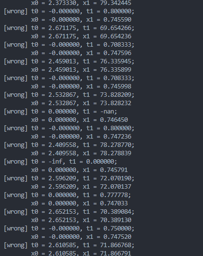

## Hit Calculation

### 二元一次方程求解

$$
ax^2 + bx + c = 0 \\
\implies x_{1,2} = \frac{-b \pm \sqrt{b^2-4ac}}{2a} \xlongequal{h = -b/2} \frac{h \pm \sqrt{h^2 - ac}}{a} \\
\implies x_1 + x_2 = -\frac{b}{a} ,x_1 \cdot x_2 = \frac{c}{a}
$$

1. 令$h = -\frac{b}{2}$，可以小幅减少一些不必要的计算；
2. 韦达定理有使用的必要吗？对于$x_1\cdot x_2$的式子来说，不是必不必要的问题，而是有些情况就是不能用：当其中一个值接近0或者就是0时，除法会导致另一个值出问题；倒是加法的公式似乎可以利用，如果事先存了$\frac{-b}{a} = \frac{h}{2a}$

   - t0,t1 就是错误使用乘法式导致的，表面上省了一次加法，然则全错

   ```
   // not corrected, would cause problem in extreme cases
   float q = h - std::sqrt(discr_new);
   x0 = q / a;
   x1 = c / q;
   ```

   - 错误的比对
     
3. 是否因乘法快于除法的缘故，事先记录 `float reverse_a = 1 / a;` 在后续使用

   - 会在 `1e-5`范围内出现误差
   - 错误比对文本
     ```
     [wrong] t0 = -431.489410, t1 = -3.403870
             x0 = -431.489441, x1 = -3.403870
             d0 = 0.000031, d1 = 0.000000
     [wrong] t0 = -203.558701, t1 = -0.944146
             x0 = -203.558685, x1 = -0.944146
             d0 = 0.000015, d1 = 0.000000
     [wrong] t0 = -217.601089, t1 = -1.402984
             x0 = -217.601074, x1 = -1.402984
             d0 = 0.000015, d1 = 0.000000
     [wrong] t0 = -156.126114, t1 = -0.736055
             x0 = -156.126099, x1 = -0.736055
             d0 = 0.000015, d1 = 0.000000
     [wrong] t0 = -204.131424, t1 = -1.082135
             x0 = -204.131409, x1 = -1.082135
             d0 = 0.000015, d1 = 0.000000
     [wrong] t0 = -159.701004, t1 = -1.224235
             x0 = -159.701019, x1 = -1.224235
             d0 = 0.000015, d1 = 0.000000
     [wrong] t0 = -143.460266, t1 = -0.728741
             x0 = -143.460251, x1 = -0.728741
             d0 = 0.000015, d1 = 0.000000
     [wrong] t0 = -499.017761, t1 = -2.713601
             x0 = -499.017731, x1 = -2.713601
             d0 = 0.000031, d1 = 0.000000
     [wrong] t0 = -146.334534, t1 = -0.828340
             x0 = -146.334549, x1 = -0.828340
             d0 = 0.000015, d1 = 0.000000
     [wrong] t0 = -236.780396, t1 = -1.134514
             x0 = -236.780411, x1 = -1.134514
             d0 = 0.000015, d1 = 0.000000
     ```
    - 上文可以发现，都是一边误差大，一边误差小；推测应该是1/a的误差对于被除数大的一个解影响更大
    
总之这导致渲染图出现明显问题（光线滞留在气泡中，最终产生黑点；连单玻璃球的渲染光泽都会有些许不同，印象中是光泽显得更加圆润，内气泡则会更小）检查调试了好久才定位到，令人感叹

### Sphere
