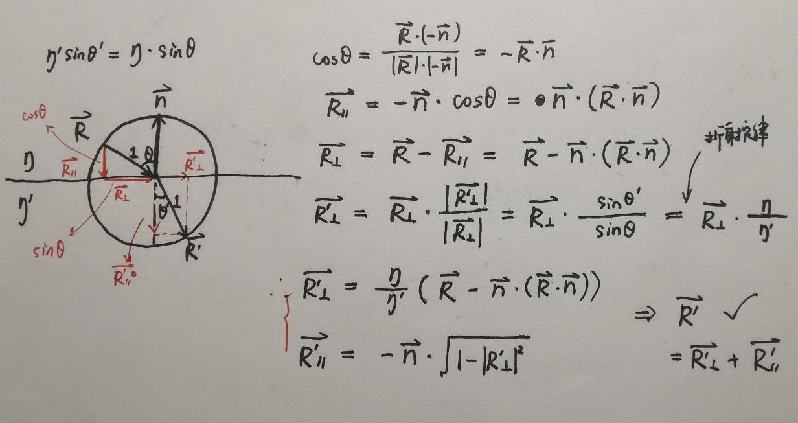
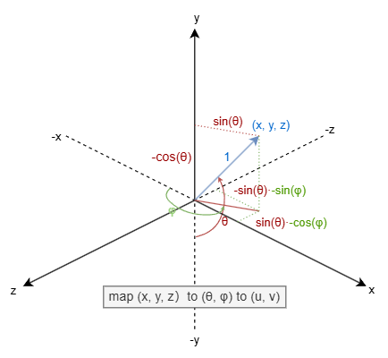
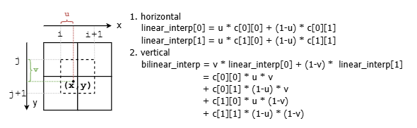
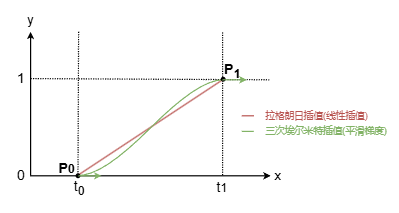
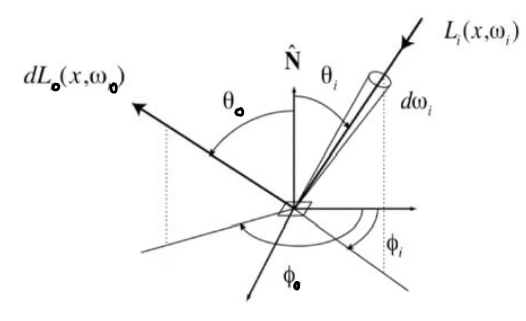
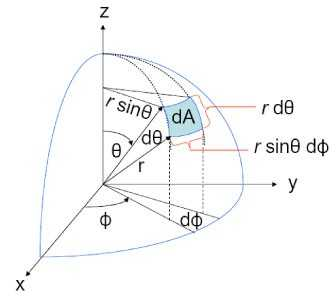
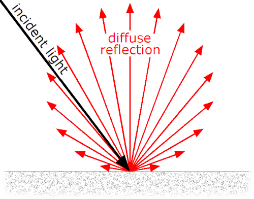

## note

### 1. 向量计算

#### 反射向量计算

#### 折射向量计算

入射光线单位向量$\vec{R}$ ， 入射折射率$\eta$ ，法线$\vec{n}$ ，出射折射率 $\eta '$ ：求出射光线单位向量$\vec{R'}$



### 2. Schlick's Approximation

对菲涅尔反射系数的近似。菲尼尔反射系数指，光从某介质进入另一介质时光被反射的比率。

完整的菲涅尔方程和反射系数公式

- 入射光的senkrecht偏振反射率：$R_s(\theta_i, \theta_t) = (\frac{\eta_1\cos\theta_i-\eta_2\cos\theta_t}{\eta_1\cos\theta_i+\eta_2\cos\theta_t})^2$   //垂直偏振
- 入射光的parallel偏振反射率：$R_p(\theta_i, \theta_t) = (\frac{\eta_1\cos\theta_t-\eta_2\cos\theta_i}{\eta_1\cos\theta_t+\eta_2\cos\theta_i})^2$   // 平行偏振
  - $\theta_i$为入射角，$\theta_t$为折射后出射角
  - $\eta_1, \eta_2$分别为入射和出射介质的折射率
- 对于无偏的光，可认为两种偏振等量，则有 $R = \frac{R_s+R_p}{2}$

近似后反射率公式为 $R(\theta_i) = R_0 + (1 - R_0)(1-\cos\theta_i)^5$

- $R(\theta_i)$ 是入射角为 $\theta_i$ 的反射率
- $R_0$ 是法向入射时的反射率，计算公式为 $R_0 = (\frac{\eta_1-\eta_2}{\eta_1+\eta_2})^2$

https://sparkfengbo.github.io/post/gl-fei-nie-er-fang-cheng-he-schlick-jin-si/

Brewster's angle 布儒斯特角：起偏振角，反射光与折射光分为互相垂直的线偏振光

- 此时反射光和折射光成90°垂直，所以有
  - $\eta_1\sin\theta_i = \eta_2\sin\theta_t$，$\theta_i + \theta_t = \pi - \frac{\pi}{2} = \frac{\pi}{2}$ $\implies$ $\eta_1\sin\theta_i = \eta_2\sin(\frac{\pi}{2}-\theta_i) = \eta_2\cos\theta_i$
  - 从而有 $\theta_B = \theta_i = \arctan(\frac{\eta_2}{\eta_1})$
- 在菲涅尔方程中，此时的平行偏振反射率为0，即$R_p = 0$，所有平行偏振光都透射进入另一介质

### 3. Hollow Glass Sphere的渲染

似乎和书上不一样,难道是全反射的问题,还是之前哪里自由发挥的锅? (递归深度50, 采样500, 小电脑渲染了好久,差不多一行像素好几秒)


深度和采样小的话,玻璃上会有很多黑点(这也是之前深度递归基忘写后测出depth爆栈的原因)

破案了：球体和光线的二元一次方程解的有问题，我说怎么之前渲染图就有些许的不同；倒退到单个玻璃球去比对然后一个一个怀疑的点注释修改查出来的

- 显然不是原则性问题，都是自以为是的优化，结果没考虑到极端浮点数运算带来的误差；具体见[hit-calculation](./hit-calculation.md)的开头

### 4. BVH加速效率不佳

#### bug 1: 由于 `bbox_cmp`引用悬垂导致的比较错误

通过将 `getBoundingBox`的返回值改为 `const AABB&`来保证引用对象存在，同时也减少拷贝次数（倒是不知道编译器会不会优化）

#### bug 2: 计算Node中AABB合并时莫名出现的某轴边界归零

问题出在 `AABB::empty`和 `AABB::universe`的初始化上；由于写成了多文件应用，所以在给AABB这两个静态变量赋值时，可能Interval的静态变量尚未初始化（两个.o呢），所以就被初始化为零了。

如果全部为头文件的话到还可以，多文件这种有依赖的静态变量，还是写成静态成员函数，等待函数别调用时，依赖项必然已经完成初始化

```cpp
const AABB& AABB::empty() {
    static AABB instance(Interval::empty, Interval::empty, Interval::empty);
    return instance;
}
const AABB& AABB::universe() {
    static AABB instance(Interval::universe, Interval::universe, Interval::universe);
    return instance;
}
```

### 5. 纹理映射

#### Sphere纹理坐标

对单位球面上的点$(x, y, z)$进行映射，最终得到$(u,v) \in [0, 1]$。

即用球坐标表示，正好两个参数$(\theta, \phi)$，然后再将参数归一化得到纹理坐标；此处球坐标稍微与标准球坐标系有所不同，$\phi$ 为与-x轴的夹角，使得值均大于0，详见下图


$$
(x, y, z) \xrightarrow{(1)} (\theta, \phi) \xrightarrow{(2)} (u, v)
$$

其中有

$$
(1) 
\left\{ \begin{aligned} y &= -\cos(\theta) \\ x &= -\sin(\theta)\cos(\phi) \\ z& = \sin(\theta)\sin(\phi) \end{aligned} \right.
    \implies
\left\{ \begin{aligned} \theta &= \arccos(-y) \\ \phi &= \arctan(-\frac{z}{x}) + \pi \end{aligned} \right.

\ \ \ 

(2)
\left\{
\begin{aligned}
u &= \frac{\phi}{2\pi} \\
v &= \frac{\theta}{\pi}
\end{aligned}
\right.
$$

关于第一个变换中的$\phi$，原本应该是$\phi = \arctan(-\frac{z}{x})$，不过对应函数 `atan2(z,-x)`的取值范围是$0 \to \pi, -\pi \to 0$，即$[-\pi, \pi]$，并不是我们想要的$[0, 2\pi]$ ...

啧，那其实还不如最原始的球坐标，然后得到这个$\phi' \in [-\pi, \pi]$，然后再做个偏移后归一化呢。反正相当于 $\phi = \phi' + \pi$，而$\phi' = \arctan(-\frac{z}{x})$，则$\phi = \arctan(-\frac{z}{x}) + \pi$

### 6. 插值

插值函数：多项式插值，分段插值，三角插值；证明n+1个节点确定n阶多项式插值函数：即x_i构成范德蒙德矩阵。

- 拉格朗日插值，牛顿插值。不过全面反映被插值函数的性态，存在龙格现象(两端震荡)
- 分段二次插值

Hermite插值：节点的函数值和n阶导数值都需要相同。直接Hermite插值得到的多项式次数高，也存在龙格现象。实际运用中常用分段三次Hermite插值多项式PCHIP

#### 三线性插值

就是两层双线性插值再插个值



#### Hermitian平滑

只用三线性插值的话，结果还是有明显的网格特征，且存在Mach Bands马赫带。因而对u, v, w进行一个三次Hermite插值，似乎就是GLSL中smoothstep的插值。smoothstep可以用来生成0到1的平滑过渡值，称为平滑梯度函数，由分段三次Hermite插值公式推导而来

$$
\textrm{smoothstep}(t) = t^2\cdot(3-2t) = -2t^3 + 3t^2
$$

本质是针对$P_0$和$P_1$点进行三次Hermite插值： $P(t) = (2t^3 - 3t^2 + 1)P_0 + (t^3 - 2t^2 + t)M_0 + (t^3 - t^2)M_1 + (-2t^3 + 3t^2)P_1$。
其中$M_0$和$M_1$是两点处的方向，也即导数，应该均为0。
这里我们已经将u,v,w控制在了$[0，1]$之间，所以只需在0~1之间做平滑，即这里设置$P_0 = (0, 0), P_1 = (1, 1)$，而方向$\vec{M_0}$和$\vec{M_1}$则都为$(0,1)$横向，即两侧区间外绝对平滑。“平滑梯度”的名称很形象



再细点，其实上述公式是个x,y关于t的参数方程

$$
\newcommand{\matrix}[1]{\left[ \begin{matrix} #1 \end{matrix} \right]}

\matrix{x\\y} = (2t^3 - 3t^2 + 1) \matrix{x_0\\y_0} + (t^3 - 2t^2 + t) \matrix{a_0\\b_0} + (t^3 - t^2) \matrix{a_1\\b_1} + (-2t^3 + 3t^2) \matrix{x_1\\y_1}  \\
= (2t^3 - 3t^2 + 1) \matrix{0\\0} + (t^3 - 2t^2 + t) \matrix{1\\0} + (t^3 - t^2) \matrix{1\\0} + (-2t^3 + 3t^2) \matrix{1\\1} \\
= \matrix{t \\ -2t^3 + 3t^2}
$$

所以有 $y = -2t^3 + 3t^2 = -2x^3 + 3x^2$ 这一简化的公式

http://www.cnitblog.com/luckydmz/archive/2014/06/23/89615.html
https://zhuanlan.zhihu.com/p/157758600

### 7. Perlin噪声改进

在基本的噪声算法中，每个网格点通常会被分配一个随机浮点数值。然后，在这些网格点之间使用插值（如三次插值）进行平滑。但是，如果这些浮点数直接作为噪声值，那么它们的最小值和最大值会总是刚好出现在整数的 x/y/z 位置上。

- 噪声图案的极值总是发生在固定的整数网格上，可能导致可见的规则性。
- 过渡不够自然，最终会看起来有点“块状”（Blocky）

改进：不是在网格点上放置随机浮点数，而是放置随机单位向量。这样之后使用了点积运算，极值会偏移，打破了规则性；相比直接使用浮点数，这种方法能消除明显的网格结构，使噪声更加平滑、细腻；由于单位向量可以朝向任意方向，噪声图案不再表现出轴对齐的特征，避免了规则的条纹或格子状伪影

### 8. 渲染时间

Cornell Box (SPP = 200, depth = 50, 400px * 400px, WSL)

- 带Transform： 632633ms = 632.633s = 10min
- smoke：840265ms = 840.265s = 14min

stage2-achievement

- SPP = 100, depth = 25, 400px * 400px, WSL：431556ms = 431.556s = 7min
- SPP = 250, depth = 25, 400px * 400px, WSL：1053010ms = 1053.010s = 17.5min = 7min * 2.5

### 9. 分层采样 Stratified Sampling

stratified sampling：对于指定的pixel，原采样是随机投射spp次光线；分层采样是再将这个pixel划分为spp个格子，随机投射将均匀分布于每个格子中

渲染时间还稍快。对于spp = 64，depth=50的Cornell Box，原采样用时203188ms，分层采样用时191859ms

### 10. 蒙特卡洛积分 Monte Carlo Integration

#### 总结

对于 $I = \int_a^b f(x) dx$ 进行Monte Carlo积分

- 采样用的随机变量 $X \sim f_X(x), x \in [a, b]$ ，进行N次独立同分布采样，即得 $X_1, X_2, ..., X_N$ ，样本值为  $x_1, x_2, ..., x_N$ .
  - $f_X(x)$ 即为随机变量X的概率密度函数pdf，离散后则为 $P\{X = x\}$ ，书中记法是 $p(x)$ 
- 则积分结果为  $I = \frac{1}{N} \sum\limits_{k=1}^{n} \frac{f(x_k)}{f_X(x_k)}$ 即 $\frac{f(x)}{f_X(x)}$的均值

#### 一些技巧

- 简化表示 $f_X(x) = \frac{x}{2}$ ：可知 $P\{ X \leq \sqrt{2} \} = 0.5$ 所以分两段 $[0, \sqrt{2}]$ 和 $[\sqrt{2}, 2]$ ，每段再用均匀分布简化模拟
- 对于任意曲线pdf，求**cdf半分位点**：假设采样N个点，然后按x升序排列，之后从前向后加 $f_X(x)$ (即**前缀和**)直到超过0.5，此时的x就是所求分位点
  - 可以多次求半分位点，递归二分，复杂度上限即排序O(nlogn)：即分治策略产生非均匀分布
  - 更高效：Metropolis-Hastings
- Metropolis-Hastings Algorithm：
- 确定cdf：产生近似分布去靠近真正的cdf
  - 有 $y = F_X(x)$ ,则有 $x = F_X^{-1}(y)$ ；CDF的逆称为ICD
  - 随机均匀采样y，可得多组x = icd(y)去，这样的(x,y)即可近似真正的cdf：**怎么感觉就是在说废话** d

#### 实现举例

举例泛化说明，计算最开始的$I$

```cpp
/* 选择的分布 */
float pdf(float x) { return ...; }
float icd(float y) { return ...; }  // y in [0, 1]

/* 被积函数 */
float f(float x) { return ...; }

/* Monte Carlo Intergration */
void main() {
    int N = xxxx;  // 采样数量
    auto res = .0; // 积分结果
    for (int i = 0; i < N; ++i) {
        auto x = icd(random_float());  // y是均匀分布，则x = icd(y)就满足cdf表示的分布
        sum += f(x) / pdf(x);
    }
    res = sum / N;
}
```

- 若用的是[a,b]的均匀分布，则有 `pdf(x) = 1 / (b - a)`，从而 `cdf(x) = x / (b - a)` ，从而 `icd(y) = y * (b - a)`
- 自定义分布：会引导样本分布在pdf大的地方，可在噪声大的场景增加pdf降噪，噪声小的地方减少pdf提高性能；好“样”用在刀刃上
  - 这样总比均匀分布更快速的收敛
  - 称为importance sampling
  - the perfect importance sampling：对于最合适的pdf，则采样数仅需1，当然本身就是答案了
    - 升维后也一样，总能找到**最正确的一个点**，配合pdf进行权重操纵

#### 单位球面上的MC积分

前提：随机方向

- 产生1维样本：之前的方法，即使用了指定cdf的反函数，因而称为反演法 inversion method
- 产生2维样本：即**单位球上的随机方向**
  - 随机方向 $\iff$ 球面上随机一点(3维样本约束在2维)
  - 若沿球面均匀分布，即可用之前实现**生成随机方向的方法**：空间中均匀随机生成，然后去除球外部分，剩下的在归一化，称为拒绝法 rejection method

e.g. 如果用MC法求 $\iint_{\Omega} \cos^2(\theta) d\vec{r}$ ，这是个曲面积分：采样沿球面均匀分布，则需要被采样均值的是 $\frac{f(\theta, \phi)}{p(\vec{r})} = \frac{f(\theta,\phi)}{p(d(\theta,\phi))}$

- 对于采样分布，则有 $p(\vec{r}) = p(\vec{d}) = \frac{1}{4\pi}$ ， $\vec{d}$ 表示单位球上随机方向
- 对于被积函数，可以发现 $f(\theta, \phi) = \cos^2(\theta) = d_z^2$ ，其中记 $\theta$ 为与z轴的夹角，0到 $\pi$ 范围
- 所以MC法可写为如下代码

  ```cpp
  float f(const vec3& d) { return d.z()*d.z(); }
  float pdf(const vec3& d) { return 1 / (4*pi); }
  
  void main() {
      int N = 1000000;
      auto res = 0.0;
      for (int i = 0; i < N; i++) {
          vec3 d = random_unit_vector();  // 可以发现二维变量可划归到d上，对应之前的x
          auto f_d = f(d);
          res += f_d / pdf(d);
      }
      res = res / N;
  }
  ```

一些定义

- 在3d空间中表示方向：单位球上的点
- 在3d空间中表示方向范围：方向区域，即空间角
  - 1d角度 - θ, 2d及以上角度 - sr

### 11. 渲染模型更换：渲染方程

#### 散射概率模型

(1) 反照率 albedo ：重新定义为 被散射的概率，不被散射scattered即被吸收asorbed

从光子的角度思考：RGB $\to$ 光子波长，如300nm , 350nm, 400nm, ... 700nm ：可以认为RGB是特殊波长的代数线性混合

- 近似的自然解释：人类视觉系统中3组特殊的色彩视锥细胞cones，敏感的波长即类似RGB，称为long / medium / short cones，这是根据敏感波长命名的
- 颜色可以表示为 在L/M/S 空间中激发对应视锥夕宝的程度

(2) 散射方向分布 pScatter：定义为散射光线在**立体角**上分布的**概率密度函数** ，书上称为**散射PDF** 

- 这个函数可能与出射方向、入射方向、光的波长(e.g. 彩虹)、散射位置有关，可记为$pScatter(\vec{x}, \omega_i, \omega_o, \lambda)$ .
  - 书中例子显示，这里入射角度incident angle指的是viewing angle，也就是说是ray tracing方向的入射角度，即光线传播的出射角度(**我感觉写错了**，这似乎是在按光追代码的视角看)
  - **albedo的因变量也是这些**，可以记为 $A(\vec{x}, \omega_i, \omega_o, \lambda)$ .
- 对于Lambertian，pScatter仅与出射角$\theta_o$ 有关，$pScatter(\vec{x}, \omega_i, \omega_o, \lambda) = C \cdot \cos(\theta_o)$ .

(3) 最终得到平面上某点的颜色：将该点单位半球面上所有入射方向的值积起来，即沿立体角积分

- 公式为 $Color_o(\vec{x}, \omega_o, \lambda) = \iint_{H^2} A(\vec{x}, \omega_i, \omega_o, \lambda) \cdot pScatter(\vec{x}, \omega_i, \omega_o, \lambda) \cdot Color_i(\vec{x}, \omega_i, \lambda) d\omega_i$ .
  - 【正常规定】往眼睛那儿是出射，从环境和光源那儿是入射
  - $d\omega$ 是立体角的微分，有公式定义 $d\omega = \frac{dA}{r^2}$, 其中 $dA$ 是球面上面积微元
    - 书上似乎默认单位球， **将立体角记作了dA，我觉得很不合适** .
  - 写成蒙特卡洛积分形式： $Color_o(\vec{x},\omega_o,\lambda) = \sum{\frac{A()\cdot pScatter() \cdot Color_i()}{p(\vec{x},\omega_i,\omega_o, \lambda)}}$ .
- Color即是递归得出的，即类似 `getRayColor()` 函数

(4) BRDF与书中pScatter的关系

BRDF的定义

- 辐射度量学
  - 能量 $Q$ ，单位 - 焦耳J
  - **辐射通量** $\Phi$ , Radiant Flux :  $\Phi = \frac{dQ}{dt}\ (\textrm{W})$ ，**单位时间**穿过截面的光能
    - 又称光通量，单位又记作 lm，流明
  - 辐射强度 $I$ , Radiant Intensity : $I = \frac{d\Phi}{d\omega}\ (\textrm{W}/\textrm{sr})$ ，单位**立体角**的辐射通量
    - 又称发光强度，单位又记作 lm/sr = cd，坎德拉
  - 辐照度 $E$ , Irradiance : $E = \frac{d\Phi}{dA} = \iint_H L(\omega) \cos \theta d\omega\ (\textrm{W}/\textrm{m}^2)$ ，单位**面积**的辐射通量
    - 又称辉度，单位又记作 lm/m2 = lux，勒克斯
  - 辐射率 $L$ , Radiance : $L = \frac{d^2\Phi}{dA \cdot \cos\theta \cdot d\omega}\ (\textrm{W}/\textrm{sr}\cdot \textrm{m}^2)$ ，单位**投影面积**和单位**立体角**的辐射通量
    - 又称光亮度 Luminance，单位又记作 lm/sr m2 = cd/m2 = nit，尼特
    - <font color="red">注意</font> ：Irradiance中用的就是寻常面积，而Radiance中关注实际投影垂直的距离，即 $dA\cdot \cos{\theta} = dA_{\perp}$ .
- 双向反射分布函数：描述表面如何反射光线，即**从某方向入射**然后**反射到各个方向**的**能量分布**
  - 定义为**反射辐射率**和**入射幅照度**的比值： $f(\omega_i, \omega_o) = \frac{dL_o(\omega_o)}{dE_i(\omega_i)} = \frac{dL_o(\omega_o)}{L_i(\omega_i)\cos\theta_i d\omega_i}$ .
    -  $\omega_i, \omega_o$ 都是从反射点出发，指向入射方向和出射方向的单位方向向量
    -   $d\omega$ 方向向量的微分即立体角微分 $\to$ 似乎很不严谨
  -   
  - 从不同方向入射的光，都可以反射到指定出射方向，因此出射部分用指定方向的辐射率，入射部分用不指定方向的辐照度
  - **出射的角标**：这里是遵循书中的写法用了 $L_o$ ，但这其实只是**反射**，用 $L_r$ 才合适
  - 其实BRDF都暗含了针对某个反射点/反射平面，所以其实因变量还包含 位置 $\vec{x}$ ，即 $f(\vec{x}, \omega_i, \omega_o)$ 
- 渲染方程
  - 即 出射光 = 自发光 + 反射光
  -   $L_o(\vec{x}, \omega_o) = L_e(\vec{x}, \omega_o) + L_r(\vec{x}, \omega_o) = L_e(\vec{x}, \omega_o) + \iint_H f(\vec{x}, \omega_i, \omega_o) \cdot L_i(\vec{x}, \omega_i) \cos\theta_i d\omega_i$ 
  - 其中 $\cos\theta_i = (\vec{n} \cdot \omega)$ 即点积形式 

书中两者关系

- 书中给出 $f(\vec{x}, \omega_i, \omega_o, \lambda) = \frac{A(\vec{x}, \omega_i, \omega_o, \lambda) \cdot pScatter(\vec{x}, \omega_i, \omega_o, \lambda)}{\cos\theta_o}$ ，则有 $pScatter(\vec{x}, \omega_i, \omega_o, \lambda) = \frac{f(\vec{x}, \omega_i, \omega_o, \lambda)\cdot\cos\theta_o}{A(\vec{x}, \omega_i, \omega_o, \lambda)}$ . 【？】
  - pScatter - 散射方向的分布函数(PDF)， 仅包含**方向**
  - BRDF - 散射方向的**能量**分布函数(PDF)，除了方向外还包含能量/颜色
    - 给BRDF增加了一个光波长的因变量，合理
- pScatter去除了BRDF中的颜色值反照度A，又将其出射的“**不仅关于立体角还相对于投影平面**的Radiance”转换为“**绝对的只关乎立体角的**辐射亮度Radiant Intensity”


#### 具体的散射PDF

| 材质           | 散射PDF                    | BRDF            | 解释                                                         |
| -------------- | -------------------------- | --------------- | ------------------------------------------------------------ |
| Lambertian     | $\frac{\cos\theta_o}{\pi}$ | $\frac{A}{\pi}$ | 散射分布见Lambertian散射图<br />仅与出射角有关 $C\cdot\cos(\theta_o)$ <br />同时下半平面不出射为0，因而pdf积半球面为1 <br /> $\iint_{H^2} C \cdot \cos\theta d\omega = 1$ , 根据球面微分$d\omega = \sin\theta d\theta d\phi$ <br />则有$C\int_0^{2\pi}\int_{0}^{\frac{\pi}{2}}\cos\theta\sin\theta d\theta d\phi = 1$,解得 $C = \frac{1}{\pi}$ |
| Normal Diffuse | $\frac{1}{2\pi}$           |                 | 散射在半球面上均匀分布                                       |

关于**立体角/单位球面的微分** $d\omega = \sin\theta d\theta d\phi$ 的推导（回顾一型曲面积分）

- 这本书的定义： $\theta$ 为向量(x, y, z)与z轴的夹角， $\phi$ 为向量投影到xoy平面后与x轴的夹角
  - 这与传统数学书上符号选择**相反**
  - 此时坐标系摆放可仍按传统数学书上的来：意识到两者其实**都是右手系**，只不过摆放位置不同
  - 此时有 **笛卡尔坐标系** 与 **球坐标系** 变换关系为 $\left\{ \begin{aligned} x =& r\sin\theta\cos\phi \\y =& r\sin\theta\cos\phi \\ z =& r\cos\theta \end{aligned} \right.$ , $\theta\in[0,\pi], \phi\in[0,2\pi]$ .
  
- 稍微不严谨的**微元法** ：$dA = (rd\theta)(r\sin\theta d\phi) = r^2\sin\theta d\theta d\phi$ 
  
    

再看 **Lambertian 反射** 

  

- 光线入射材质后，从**不同角度**观察的反射光线： **Radiant Intensity** 值（单位立体角）如图成一个圆，即 $C\cdot\cos\theta$ ，而 **Radiance** 值（单位立体角单位投影面积）则为常数。

### 12. 渲染模型的计算

#### MC法采样PDF选择 - Importance Sampling

已知：采样PDF与待采样函数（真实光线情况）越接近，效果越好收敛速度越快

从实际光线情况出发，构造PDF

- 光线集中向光源的PDF：记为pLight
- 光线从表面反射的PDF：记为pSurface

可以合成某个不错的采样PDF，如 $p(\omega_o) = \lambda\cdot pSurface(\omega_o) + (1-\lambda)\cdot pLight(\omega_o)$ ，取 $\lambda = 0.5$ .

- 最终级的目标是让pdf和最终正确的颜色 $pScatter() \cdot Color_i()$ 相近
- 对于漫反射材质，Color比较重要，即有效光线来源比较重要（pLight权重大些？）；对于镜面材质，pScatter比较重要，即要看观察方向o在不在散射对的位置（pSurface权重大些）


### 13. 随机方向生成 - Inversion Method
