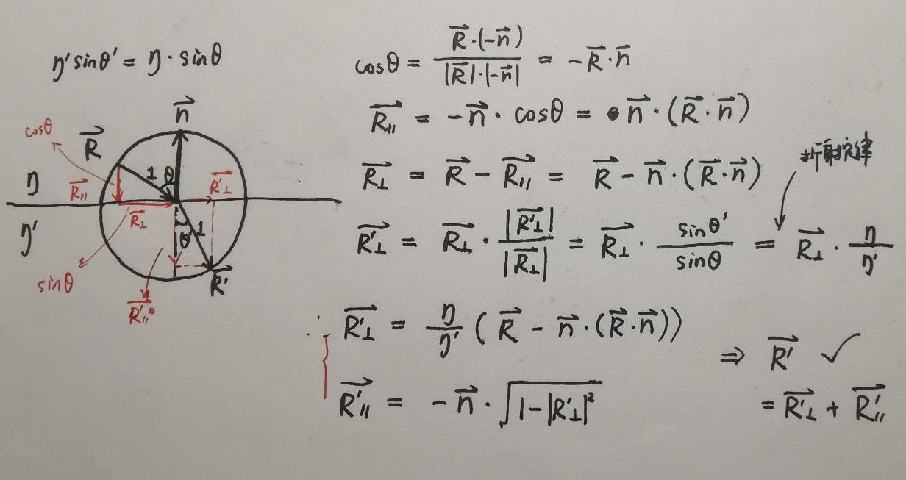
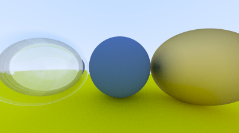
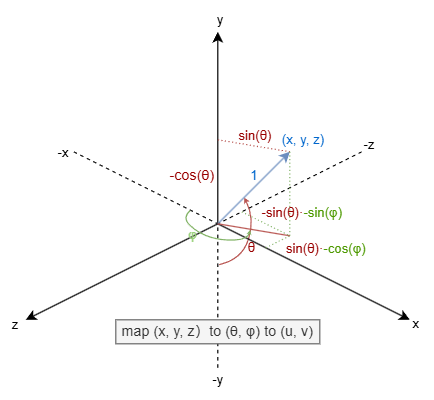
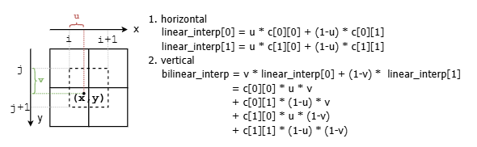
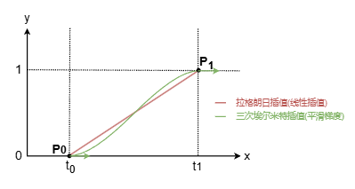

## note

### 向量计算

#### 反射向量计算

#### 折射向量计算

入射光线单位向量$\vec{R}$ ， 入射折射率$\eta$ ，法线$\vec{n}$ ，出射折射率 $\eta '$ ：求出射光线单位向量$\vec{R'}$



### Schlick's Approximation

对菲涅尔反射系数的近似。菲尼尔反射系数指，光从某介质进入另一介质时光被反射的比率。

完整的菲涅尔方程和反射系数公式

- 入射光的senkrecht偏振反射率：$R_s(\theta_i, \theta_t) = (\frac{\eta_1\cos\theta_i-\eta_2\cos\theta_t}{\eta_1\cos\theta_i+\eta_2\cos\theta_t})^2$   //垂直偏振
- 入射光的parallel偏振反射率：$R_p(\theta_i, \theta_t) = (\frac{\eta_1\cos\theta_t-\eta_2\cos\theta_i}{\eta_1\cos\theta_t+\eta_2\cos\theta_i})^2$   // 平行偏振
  - $\theta_i$为入射角，$\theta_t$为折射后出射角
  - $\eta_1, \eta_2$分别为入射和出射介质的折射率
- 对于无偏的光，可认为两种偏振等量，则有 $R = \frac{R_s+R_p}{2}$

近似后反射率公式为 $R(\theta_i) = R_0 + (1 - R_0)(1-\cos\theta_i)^5$

- $R(\theta_i)$ 是入射角为 $\theta_i$ 的反射率
- $R_0$ 是法向入射时的反射率，计算公式为 $R_0 = (\frac{\eta_1-\eta_2}{\eta_1+\eta_2})^2$

https://sparkfengbo.github.io/post/gl-fei-nie-er-fang-cheng-he-schlick-jin-si/

Brewster's angle 布儒斯特角：起偏振角，反射光与折射光分为互相垂直的线偏振光

- 此时反射光和折射光成90°垂直，所以有
  - $\eta_1\sin\theta_i = \eta_2\sin\theta_t$，$\theta_i + \theta_t = \pi - \frac{\pi}{2} = \frac{\pi}{2}$ $\implies$ $\eta_1\sin\theta_i = \eta_2\sin(\frac{\pi}{2}-\theta_i) = \eta_2\cos\theta_i$
  - 从而有 $\theta_B = \theta_i = \arctan(\frac{\eta_2}{\eta_1})$
- 在菲涅尔方程中，此时的平行偏振反射率为0，即$R_p = 0$，所有平行偏振光都透射进入另一介质

### Hollow Glass Sphere的渲染

似乎和书上不一样,难道是全反射的问题,还是之前哪里自由发挥的锅? (递归深度50, 采样500, 小电脑渲染了好久,差不多一行像素好几秒)



深度和采样小的话,玻璃上会有很多黑点(这也是之前深度递归基忘写后测出depth爆栈的原因)

破案了：球体和光线的二元一次方程解的有问题，我说怎么之前渲染图就有些许的不同；倒退到单个玻璃球去比对然后一个一个怀疑的点注释修改查出来的
- 显然不是原则性问题，都是自以为是的优化，结果没考虑到极端浮点数运算带来的误差；具体见[hit-calculation](./hit-calculation.md)的开头

### BVH加速效率不佳

#### bug 1: 由于`bbox_cmp`引用悬垂导致的比较错误

通过将`getBoundingBox`的返回值改为`const AABB&`来保证引用对象存在，同时也减少拷贝次数（倒是不知道编译器会不会优化）

#### bug 2: 计算Node中AABB合并时莫名出现的某轴边界归零

问题出在`AABB::empty`和`AABB::universe`的初始化上；由于写成了多文件应用，所以在给AABB这两个静态变量赋值时，可能Interval的静态变量尚未初始化（两个.o呢），所以就被初始化为零了。

如果全部为头文件的话到还可以，多文件这种有依赖的静态变量，还是写成静态成员函数，等待函数别调用时，依赖项必然已经完成初始化

```cpp
const AABB& AABB::empty() {
    static AABB instance(Interval::empty, Interval::empty, Interval::empty);
    return instance;
}
const AABB& AABB::universe() {
    static AABB instance(Interval::universe, Interval::universe, Interval::universe);
    return instance;
}
```

### 纹理映射

#### Sphere纹理坐标
对单位球面上的点$(x, y, z)$进行映射，最终得到$(u,v) \in [0, 1]$。

即用球坐标表示，正好两个参数$(\theta, \phi)$，然后再将参数归一化得到纹理坐标；此处球坐标稍微与标准球坐标系有所不同，$\phi$ 为与-x轴的夹角，使得值均大于0，详见下图



$$
(x, y, z) \xrightarrow{(1)} (\theta, \phi) \xrightarrow{(2)} (u, v) 
$$

其中有
$$
(1) 
\left\{ \begin{aligned} y &= -\cos(\theta) \\ x &= -\sin(\theta)\cos(\phi) \\ z& = \sin(\theta)\sin(\phi) \end{aligned} \right.
    \implies
\left\{ \begin{aligned} \theta &= \arccos(-y) \\ \phi &= \arctan(-\frac{z}{x}) + \pi \end{aligned} \right.

\ \ \ 

(2)
\left\{
\begin{aligned}
u &= \frac{\phi}{2\pi} \\
v &= \frac{\theta}{\pi}
\end{aligned}
\right.
$$

关于第一个变换中的$\phi$，原本应该是$\phi = \arctan(-\frac{z}{x})$，不过对应函数`atan2(z,-x)`的取值范围是$0 \to \pi, -\pi \to 0$，即$[-\pi, \pi]$，并不是我们想要的$[0, 2\pi]$ ... 

啧，那其实还不如最原始的球坐标，然后得到这个$\phi' \in [-\pi, \pi]$，然后再做个偏移后归一化呢。反正相当于 $\phi = \phi' + \pi$，而$\phi' = \arctan(-\frac{z}{x})$，则$\phi = \arctan(-\frac{z}{x}) + \pi$

### 插值

插值函数：多项式插值，分段插值，三角插值；证明n+1个节点确定n阶多项式插值函数：即x_i构成范德蒙德矩阵。
- 拉格朗日插值，牛顿插值。不过全面反映被插值函数的性态，存在龙格现象(两端震荡)
- 分段二次插值

Hermite插值：节点的函数值和n阶导数值都需要相同。直接Hermite插值得到的多项式次数高，也存在龙格现象。实际运用中常用分段三次Hermite插值多项式PCHIP

#### 三线性插值
就是两层双线性插值再插个值



#### Hermitian平滑

只用三线性插值的话，结果还是有明显的网格特征，且存在Mach Bands马赫带。因而对u, v, w进行一个三次Hermite插值，似乎就是GLSL中smoothstep的插值。smoothstep可以用来生成0到1的平滑过渡值，称为平滑梯度函数，由分段三次Hermite插值公式推导而来

$$
\textrm{smoothstep}(t) = t^2\cdot(3-2t) = -2t^3 + 3t^2
$$ 

本质是针对$P_0$和$P_1$点进行三次Hermite插值： $P(t) = (2t^3 - 3t^2 + 1)P_0 + (t^3 - 2t^2 + t)M_0 + (t^3 - t^2)M_1 + (-2t^3 + 3t^2)P_1$。
其中$M_0$和$M_1$是两点处的方向，也即导数，应该均为0。
这里我们已经将u,v,w控制在了$[0，1]$之间，所以只需在0~1之间做平滑，即这里设置$P_0 = (0, 0), P_1 = (1, 1)$，而方向$\vec{M_0}$和$\vec{M_1}$则都为$(0,1)$横向，即两侧区间外绝对平滑。“平滑梯度”的名称很形象



再细点，其实上述公式是个x,y关于t的参数方程
$$
\newcommand{\matrix}[1]{\left[ \begin{matrix} #1 \end{matrix} \right]}

\matrix{x\\y} = (2t^3 - 3t^2 + 1) \matrix{x_0\\y_0} + (t^3 - 2t^2 + t) \matrix{a_0\\b_0} + (t^3 - t^2) \matrix{a_1\\b_1} + (-2t^3 + 3t^2) \matrix{x_1\\y_1}  \\
= (2t^3 - 3t^2 + 1) \matrix{0\\0} + (t^3 - 2t^2 + t) \matrix{1\\0} + (t^3 - t^2) \matrix{1\\0} + (-2t^3 + 3t^2) \matrix{1\\1} \\
= \matrix{t \\ -2t^3 + 3t^2}
$$

所以有 $y = -2t^3 + 3t^2 = -2x^3 + 3x^2$ 这一简化的公式


http://www.cnitblog.com/luckydmz/archive/2014/06/23/89615.html \
https://zhuanlan.zhihu.com/p/157758600