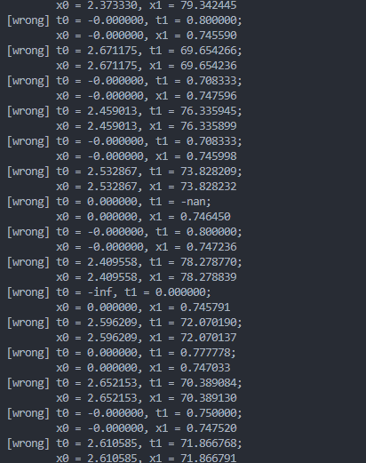
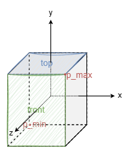

# 光线求交笔记

本文记录 Nearlighter 当前几何求交的数学基础、数据语义和可继续优化的方向。求交负责回答“给定光线首先碰到什么”；面积采样和 PDF 负责回答“下一条光线应按什么分布生成”。两者会复用几何计算，但不是同一个过程。

## 通用模型

光线表示为

$$
R(t)=O+t\vec{d},\qquad t\in[t_{min},t_{max}]
$$

- $O$：光线原点。
- $\vec d$：光线方向，不要求为单位向量。
- $t$：沿参数方程的位置；只有 $\lVert\vec d\rVert=1$ 时才等于欧氏距离。
- `Interval`：当前允许的 $t$ 范围。求最近命中时，上界会随已找到的命中不断缩小。

一次完整命中至少需要恢复：

- 参数 $t$ 和世界空间交点 $P=R(t)$；
- 几何朝向、法线和 `front_face`；
- 材质；
- UV 或其他局部坐标。

各基元可以采用不同的数值算法。`Shape::hit()` 统一局部空间几何查询，返回不含材质的 `ShapeHit`；`Intersectable::hit()` 统一当前坐标空间的遍历查询，返回带材质的 `HitRecord`。顶层查询的当前空间就是世界空间；`Primitive` 在 Shape 局部空间与其父空间之间完成 Transform、正反面和 Material 绑定。

### 仿射坐标变换

`Mat4f` 是项目自有的列优先四阶矩阵类型，仿射语义由 `Transform` 负责。`Transform` 缓存正逆矩阵、逆线性变换行列式的绝对值、orientation reversal 和 identity 状态。对输入 Ray 求局部几何交点时使用逆变换，但不归一化局部方向，因此同一参数 $t$ 在两个坐标系中保持不变。法线使用线性变换的逆转置，非均匀缩放后再归一化。

恒等 Transform 直接传递 Ray、交点和法线，不执行矩阵乘法，也不再次归一化已有单位法线。这是普通未变换 Primitive 的主路径，同时保证重构前后的确定性数值轨迹不因无意义运算而变化。

Shape 的几何采样定义在局部方向空间；Primitive 将 origin 和 direction 转入局部空间，并用方向映射 Jacobian 把局部立体角密度转换到世界空间。`SurfacePDF` 只组合这些世界空间表面目标，Material 不参与该概率分布。

### 世界 BVH

当前世界 BVH 是递归二叉层次。构建时先复制对象指针，在每个节点的最长包围盒轴上按 AABB centroid 使用 `nth_element` 做中位数划分，因此不会修改 Scene 暴露的插入顺序。内部节点缓存子树包围盒，单对象叶只保存一个对象引用。

遍历先用节点 AABB 剪枝；第一个子树命中后，以该命中的 $t$ 收紧第二个子树的查询上界，从而返回全局最近命中。当前实现仍是标量二叉 BVH，不包含 SAH、扁平节点、宽 BVH、按实际入射距离排序子节点或 SIMD。

## 数值边界

### 一元二次方程

一般形式为

$$
ax^2+bx+c=0,
\qquad
x_{0,1}=\frac{-b\pm\sqrt{b^2-4ac}}{2a}.
$$

当前球体求交令 $b=-2h$，得到

$$
x_{0,1}=\frac{h\pm\sqrt{h^2-ac}}{a}.
$$

这样可以省去若干常数乘法，但不会自动改善所有浮点误差。

韦达关系

$$
x_0+x_1=-\frac ba,
\qquad
x_0x_1=\frac ca
$$

在实数代数中成立，但用 $x_1=c/(ax_0)$ 恢复另一个根时需要额外处理：

- 被选作除数的根可能为零或非常接近零；
- 减去两个接近的数会产生灾难性消减；
- 稳定写法必须根据 $b$ 的符号选择绝对值较大的根，并处理退化情况。

下面这种固定选择减号的写法并不稳健：

```cpp
float q = h - std::sqrt(discriminant);
x0 = q / a;
x1 = c / q;
```

它曾导致玻璃球内部路径异常和黑点：



同理，预先保存 `inverse_a = 1 / a` 再以乘法代替两次除法，可能改变末位舍入。是否值得采用应由误差要求和 benchmark 决定，不能只按指令数量判断。

### 容差与自相交

- 平面与三角形求交用小容差识别数值上的近似平行；AABB/Box 的 slab 求交保留 IEEE 除零产生的无穷区间语义，使严格平行射线可正确剪枝，同时不丢弃方向很小但在有限参数处仍有效的远距离命中。
- 次级光线使用正的 $t_{min}$，避免立即再次命中刚离开的表面。
- 固定世界尺度的 epsilon 并非对所有场景都稳健：过小会自相交，过大可能漏掉很近的表面。
- 相邻三角形必须采用一致的边界规则，否则共享边可能出现裂缝或重复命中。

## Sphere

球面方程为

$$
\lVert P-C\rVert^2=r^2.
$$

代入 $P=O+t\vec d$。当前实现令 $\vec{oc}=C-O$：

$$
a=\vec d\cdot\vec d,
\qquad
h=\vec d\cdot\vec{oc},
\qquad
c=\vec{oc}\cdot\vec{oc}-r^2,
$$

从而求解

$$
at^2-2ht+c=0.
$$

实现流程：

1. 按 `ray.time()` 求运动球当前球心。
2. 解二次方程并按从近到远检查两个根。
3. 只接受位于 `ray_t` 内的最近根。
4. 用 $(P-C)/r$ 得到外法线，并计算球面 UV。

球体具有解析方程，不需要先构造一个平面。其求交成本固定，包围盒只用于 BVH 剔除。

## Quad

当前 Quad 是由原点 $P_0$ 和两条边 $\vec u,\vec v$ 张成的平行四边形：

$$
P=P_0+a\vec u+b\vec v,
\qquad 0\le a\le1,
\qquad 0\le b\le1.
$$

几何法线和面积为

$$
\vec n=\vec u\times\vec v,
\qquad
A=\lVert\vec n\rVert.
$$

实现先求光线与平面的 $t$，再令 $\vec p=P-P_0$，利用预计算量

$$
\vec w=\frac{\vec n}{\vec n\cdot\vec n}
$$

恢复局部坐标：

$$
a=\vec w\cdot(\vec p\times\vec v),
\qquad
b=\vec w\cdot(\vec u\times\vec p).
$$

`a`、`b` 同时用于范围判断和 UV，因此没有额外做一次纹理坐标转换。

### Box

当前 `Box` 是独立的局部 Shape：



它使用 slab 区间恢复进入或离开表面的参数和 outward normal，不建立六个堆对象，也不需要内部 BVH。Box 在局部空间保持轴对齐；旋转和缩放由外层 Primitive Transform 处理。AABB 仍只承担空间界限和加速剔除，不是可着色基元。

## Triangle

### 重心坐标

设三个顶点为 $P_0,P_1,P_2$：

$$
\vec e_1=P_1-P_0,
\qquad
\vec e_2=P_2-P_0.
$$

三角形上的点可写为

$$
P=P_0+b_1\vec e_1+b_2\vec e_2,
$$

其内部约束为

$$
b_1\ge0,
\qquad
b_2\ge0,
\qquad
b_1+b_2\le1.
$$

第三个重心权重为 $b_0=1-b_1-b_2$。

### Möller–Trumbore

当前实现使用 Möller–Trumbore，直接联立

$$
O+t\vec d=P_0+b_1\vec e_1+b_2\vec e_2
$$

求出 $t,b_1,b_2$，无需单独存储或计算平面方程。令

$$
\vec p=\vec d\times\vec e_2,
\qquad
\det=\vec e_1\cdot\vec p,
\qquad
\vec s=O-P_0,
\qquad
\vec q=\vec s\times\vec e_1,
$$

则

$$
b_1=\frac{\vec s\cdot\vec p}{\det},
\qquad
b_2=\frac{\vec d\cdot\vec q}{\det},
\qquad
t=\frac{\vec e_2\cdot\vec q}{\det}.
$$

实现按成本从低到高依次拒绝：

1. $|\det|$ 过小：平行或近似平行。
2. $b_1$ 不在 $[0,1]$。
3. $b_2<0$ 或 $b_1+b_2>1$。
4. $t$ 不在当前 `ray_t`。

当前算法简单、存储少，适合作为学习实现，但不是 watertight：极端细小三角形或共享边附近可能因两个三角形的浮点计算方向不同而出现裂缝。需要更高鲁棒性时，应优先评估 Woop、Benthin 和 Wald 的 watertight 算法，而不是仅调大 epsilon。

### 属性插值

同一组重心权重可以插值顶点属性：

$$
X(P)=b_0X_0+b_1X_1+b_2X_2.
$$

当前实现用它插值纹理坐标和可选顶点法线。没有 UV 时，使用 $(b_1,b_2)$ 作为稳定的局部坐标。

## 平面内有界基元

平面可以写成

$$
\vec n\cdot P=D_p.
$$

代入光线可得

$$
t=\frac{D_p-\vec n\cdot O}{\vec n\cdot\vec d}.
$$

当 $|\vec n\cdot\vec d|$ 接近零时，光线与平面平行。得到平面交点后，还需要把交点转换到平面局部坐标，再判断它是否位于有限区域内。

因此，“平面求交 + 二维区域约束”在数学上可以统一圆盘、矩形、凸多边形等共面基元。但不建议现在增加一个带虚函数的 `PlanarShape` 层级：

- Triangle 有更直接且成熟的重心坐标算法；
- 不同区域的边界规则、UV、面积采样和退化处理并不相同；
- 抽象层本身不能统一这些数值策略。

如果后续确实出现多个共面基元，更合适的第一步是复用轻量 `PlaneFrame` 或平面求交工具，而不是改变整个 Shape 继承关系。

### Mesh

#### 数据表示

当前 `MeshData` 使用共享顶点和三角形索引：

```text
positions             P0 P1 P2 ...
normals               N0 N1 N2 ...   optional
texture_coordinates   T0 T1 T2 ...   optional
triangles             (i0, i1, i2) ...
```

Triangle 只保存 `MeshData` 共享指针和一个面索引，不复制三个顶点。Mesh 负责：

- 校验索引、属性长度和退化三角形；
- 可选生成顶点法线；
- 为每个 indexed face 创建 Triangle；
- 为这些 Triangle index 建立私有局部 BVH；
- 以一个 Shape 的形式向 Primitive 暴露整体局部包围盒和求交入口。

#### 数据组织

当前分为两层：Mesh 作为 Primitive 的 Shape 加入世界 BVH，而 Mesh 自身维护一棵只处理 `ShapeHit` 的 Triangle-index BVH。局部 BVH 不继承世界 `Intersectable`，也不携带 Material 或 Transform。

不使用类似 Quad Box 的摊平结构，是为了保持更好的组织结构，以适合模型资源、整体变换、独立重建和实例复用。这也是现代 API 中 TLAS/BLAS 的基本思路。

#### 高性能实现方向

当前 Triangle 对象连续保存在 Mesh 中，私有 BVH 叶节点保存 Triangle index，已经避免逐 Triangle 的 `shared_ptr<Shape>` 堆分配。CPU 高性能实现还可进一步采用：

- 连续顶点、索引和 primitive metadata 数组；
- 扁平或宽 BVH，叶节点保存 Triangle 范围或压缩块；
- 以 primitive ID 取数据，避免每个 Triangle 单独堆分配和虚调用；
- SAH 等更好的 BVH 构建策略；
- 预计算边向量或坐标变换，以内存换求交运算；
- SIMD 同时测试多个节点、Triangle 或 ray packet；
- 独立 BLAS 与 TLAS，以支持实例和动态更新。

“最快”取决于 CPU、编译器、命中率、缓存、预计算量和数据是否动态，不能只比较单次 Möller–Trumbore 的浮点操作数。


## 研究与工程参考

- [Möller and Trumbore, Fast, Minimum Storage Ray-Triangle Intersection, 1997](https://www.graphics.cornell.edu/pubs/1997/MT97.pdf)：当前实现采用的直接重心坐标求解。
- [Woop, Benthin and Wald, Watertight Ray/Triangle Intersection, 2013](https://jcgt.org/published/0002/01/05/)：共享边和极端三角形的稳健求交。
- [Baldwin and Weber, Fast Ray-Triangle Intersections by Coordinate Transformation, 2016](https://jcgt.org/published/0005/03/03/)：以每 Triangle 预计算数据换取更低求交成本。
- [Pichler et al., Precomputed Fast Rejection Ray-Triangle Intersection, 2022](https://repositum.tuwien.at/handle/20.500.12708/142177)：平面求交、二维变换和快速拒绝路线；说明“平面 + 区域判断”仍可形成有效专用算法。
- [Hart, Sphere Tracing, 1996](https://experts.illinois.edu/en/publications/sphere-tracing-a-geometric-method-for-the-antialiased-ray-tracing/)：基于距离界的隐式曲面求交。
- [Seyb et al., Non-linear Sphere Tracing for Rendering Deformed Signed Distance Fields, 2019](https://cs.dartmouth.edu/~wjarosz/publications/seyb19nonlinear.pdf)：把 sphere tracing 拓展到形变 SDF。
- [Embree](https://github.com/RenderKit/embree)：CPU 高性能 Triangle、Quad、curve 和 subdivision surface 求交实现。
- [Vulkan Acceleration Structures](https://docs.vulkan.org/spec/latest/chapters/accelstructures.html)：Triangle/AABB geometry 与顶层、底层加速结构的工业 API 组织。
- [VK_NV_cluster_acceleration_structure](https://github.khronos.org/Vulkan-Site/features/latest/features/proposals/VK_NV_cluster_acceleration_structure.html)：面向高密度、动态 Triangle 集群的近期工程方向。

截至 2026 年，尚没有一种新的标量 Ray–Triangle 公式在所有场景中全面取代 Möller–Trumbore 或 watertight 路线。近期提升更多集中在 BVH、数据布局、SIMD/固定功能硬件、Triangle cluster、动态重建和实例管理，而不是把所有几何统一成单一求交公式。
